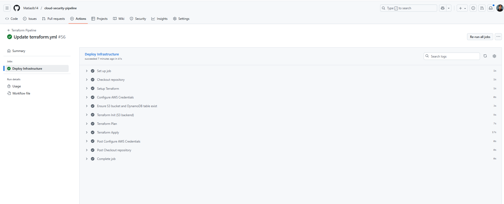
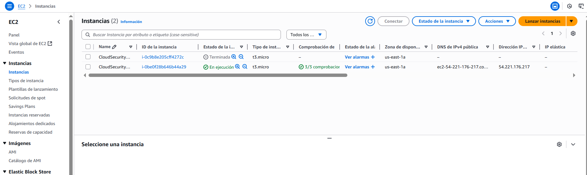
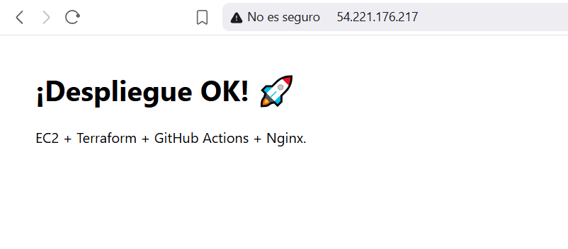

# Cloud Security Demo: Terraform + GitHub Actions + AWS EC2 + Nginx

Provision a hardened, free-tier EC2 instance on AWS with Terraform, fully automated by GitHub Actions.  
The workflow builds infra on push to `main` and can tear it down with a separate `destroy` workflow.  
Nginx is installed via cloud-init (user data) and serves a simple landing page.

## ✨ Features
- **IaC**: Terraform for reproducible infrastructure
- **CI/CD**: GitHub Actions runs `init → plan → apply` on push
- **Security**
  - SSH allowed **only from your public IP (/32)**
  - HTTP (80) open for demo
  - AWS creds kept as **GitHub Encrypted Secrets**
- **Free-tier friendly**: `t3.micro` (or `t2.micro` if needed)
- **One-click destroy**: separate workflow to clean up resources

## 🏗️ Architecture
GitHub Actions ──(configure-aws-credentials)──► AWS
│
└─► Terraform (VPC default, SG rules, EC2 + user_data Nginx)
│
└─► Public EC2 with Nginx (HTTP 80)

## 📁 Repository Structure
.
├── .github/workflows/
│ ├── terraform.yml # CI/CD: init/plan/apply on push to main
│ └── destroy.yml # CI/CD: terraform destroy on demand
└── terraform/
├── main.tf # provider, SG, EC2 + user_data (Nginx)
├── variables.tf # inputs (region, key pair, IP, etc.)
└── outputs.tf # public IP/DNS + SSH helper

## 🔐 Required Secrets (GitHub → Repo → Settings → Secrets and variables → Actions)
- `AWS_ACCESS_KEY_ID`
- `AWS_SECRET_ACCESS_KEY`
- `MY_IP_CIDR` → your public IP with `/32` (e.g., `203.0.113.10/32`)
- `KEY_PAIR_NAME` → name of an existing EC2 key pair (e.g., `mati-key`)
- *(optional)* `ALARM_EMAIL`

> Tip: get your public IP and append `/32` once.

## ⚙️ How It Works
1. Push to `main` triggers `.github/workflows/terraform.yml`.
2. The workflow:
   - Checks out the repo
   - Installs Terraform
   - Configures AWS credentials
   - Runs `terraform init`, `plan`, and `apply`
3. EC2 boots and `user_data` installs Nginx + a landing page.

## 🚀 Deploy
Commit & push to `main`. GitHub Actions provisions your stack automatically.

## 🌐 Access
Terraform outputs provide the IP/DNS:

instance_public_ip = x.x.x.x
instance_public_dns = ec2-xx-xx-xx-xx.compute-1.amazonaws.com

Open: `http://<public-ip-or-dns>/`

## 🔑 SSH (from your machine)
```bash
ssh -i ~/.ssh/<your-key>.pem ubuntu@<public-dns>

Ensure MY_IP_CIDR matches your current IP (/32).

🧹 Destroy

Trigger the destroy.yml workflow (Actions tab) to run:

terraform destroy -auto-approve

💸 Costs

Designed for the AWS free tier, but always destroy when done to avoid charges.

🔒 Security Notes

Never commit credentials or state.

Keep SSH restricted to /32.

For prod, terminate HTTP with TLS (ACM + ALB or Nginx certs).

Consider private subnets + SSM Session Manager.

🧰 Troubleshooting

InvalidParameterCombination: instance type not free-tier → switch to t3.micro/t2.micro.

permission denied (publickey) → ensure the key pair exists in the region and you use the matching .pem.

🗺️ Roadmap

HTTPS with ACM/ALB

CloudWatch alarms

SSM Session Manager & SSH-less ops

## Screenshots

[](docs/actions-apply-green.png)

[](docs/ec2-running.png)

[](docs/nginx-landing.png)
